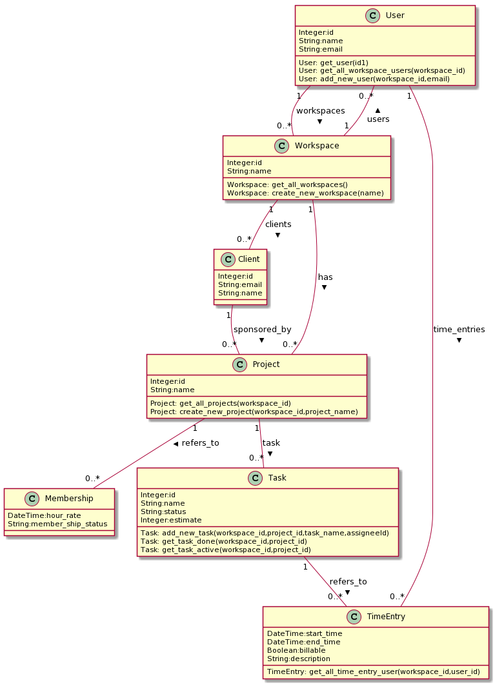

# Documentation

## Application Conceptual Data Model
	
	
## Entities
	
* **Client** : Client of project
* **Project** : Project has one or more Tasks performed by Users connected to the Project through Membership
* **Task** : Activity developed by a Team member
* **Workspace** : A Workspace is an entity that groups Projects related to a Client.
* **TimeEntry** : Represents time spent on a Task by a User 
* **User** : An user
* **Membership** : An user in a Project

## Functions of Project:	
* **get_all_projects (1workspace_id)**: returns all project from a workspace
* **create_new_project (1workspace_id,2project_name)**: create a new project in a workspace
## Functions of Task:	
* **add_new_task (1workspace_id,2project_id,3task_name,4assigneeId)**: create a new task in a project
* **get_task_done (1workspace_id,2project_id)**: returns all done tasks
* **get_task_active (1workspace_id,2project_id)**: returns all active tasks
## Functions of Workspace:	
* **get_all_workspaces ()**: returns all workspace from a user
* **create_new_workspace (1name)**: create new worskspace
## Functions of TimeEntry:	
* **get_all_time_entry_user (1workspace_id,2user_id)**: returns all time entry
## Functions of User:	
* **get_user (1id)**: returns all users
* **get_all_workspace_users (1workspace_id)**: returns all users from a workspace
* **add_new_user (1workspace_id,2email)**: add new user in a workspace
		
## Copyright
This lib was PowerRight by [SEON Application Lib Generator](https://gitlab.com/mdd_seon/from_application_conceptual_data_model_2_lib_application) 
